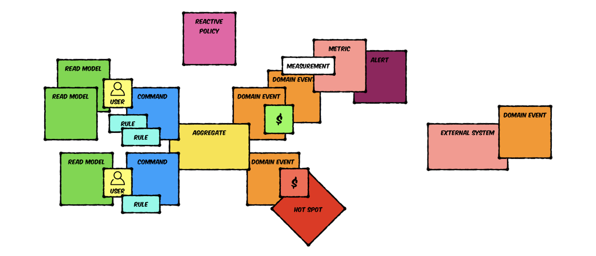

# Awesome EventStorming

EventStorming is a workshop-based method to quickly find out what is happening in the domain of a software program.[1] Comparing to other methods it is extremely lightweight and requires intentionally no support by a computer. The result is expressed in sticky notes on a wide wall. The business process is "stormed out" as a series of domain events which are denoted as orange stickies (Wikipedia definition)

My first contact with EventStorming was accidental, it was just a new method proposed by someone from the team for fast introduction into the domain.  Nowadays, after few years of practicing, using it in different projects, providing workshops and digging into EventStorming (as Alberto said many times, we just only scratched the surface!) this technique became one of my most important tools.

Do you need to know this tool? No matter if you work on green-field software, legacy application or even non-IT project, you will find benefits in this technique. So... why not?

> It's developer's (mis)understanding, not expert knowledge that gets released into production
> - Alberto Brandolini

You can find here some links to interesting materials, articles or presentations about EventStorming. Pull-requests are always welcome!

## Notation (extended)

EventStorming offers notation for process and software modeling, like Events, Commands, Aggregates, Read Models... Notation is open and you can always add your own elements to make model even better. This is why I'm using Rules, Metrics, Alerts and few other concepts. It's always about embedding different perspectives into model, making them visible.

  

## Example Big Picture session

2x3h of Big Picture sessions we performed in our project:

  

## Books

- [Introducing EventStorming, Alberto Brandolini](http://eventstorming.com)
- [Domain-Driven Design Distilled, Chapter 7: Acceleration and Management Tools, Vaughn Vernon](https://www.pearson.com/us/higher-education/program/Vernon-Domain-Driven-Design-Distilled/PGM332632.html)

## Articles

- [Introducing EventStorming, Alberto Brandolini](http://ziobrando.blogspot.com/2013/11/introducing-event-storming.html)
- [Facilitating EventStorming, Mathias Verraes](http://verraes.net/2013/08/facilitating-event-storming/)
- [An introduction to EventStorming: The easy way to achieve domain-driven design, Steven A. Lowe](https://techbeacon.com/introduction-event-storming-easy-way-achieve-domain-driven-design)
- [Modelling Reactive Systems with EventStorming and Domain-Driven Design, Kevin Webber](https://blog.redelastic.com/corporate-arts-crafts-modelling-reactive-systems-with-event-storming-73c6236f5dd7)
- [EventStorming: On Fake Domains and Happy Paths, Mathias Verraes](http://verraes.net/2014/07/event-storming-fake-domains-happy-paths/)
- [EventStorming, Storytelling, Visualisations, Mathias Verraes](http://verraes.net/2015/03/event-storming-storytelling-visualisations/)
- [EventStorming Exercise, Tim Schraepen](http://sch3lp.github.io/2014/07/12/event-storming-exercise/)
- [EventStorming: Warsztaty Product Craftsmanship Agile Wrocław, Rafał Makara (PL)](https://rmakara.github.io/Event-Storming-Warsztaty-Agile-Wroclaw)
- [How to Use Event Storming for Product Development, Andrzej Samek](https://developers.livechatinc.com/blog/event-storming-for-product-development/)
- [Event Storming and Spring with a Splash of DDD, Jakub Pilimon](https://spring.io/blog/2018/04/11/event-storming-and-spring-with-a-splash-of-ddd)
- [EventStorming's Coincidence with Business Process Improvement](https://buildplease.com/pages/lean/)
- "First Pop Coffee Company" series, Nick Chamberlain
  - [Big Picture EventStorming](https://buildplease.com/pages/fpc-2/)
  - [Domain Discoveries](https://buildplease.com/pages/fpc-3/)
  - [Hotspots](https://buildplease.com/pages/fpc-4/)
  - [People and Commands](https://buildplease.com/pages/fpc-5/)
  - [Design Level EventStorming](https://buildplease.com/pages/fpc-6/)
  - [Complexity and Cost](https://buildplease.com/pages/fpc-7/)
  - [Design Level EventStorming Continued](https://buildplease.com/pages/fpc-8/)
- [EventStorming, What You Need to Know, Daniel Whittaker](http://danielwhittaker.me/2016/07/08/eventstorming-what-you-need-to-know/)
- [How Event Storming Will Improve Your Business Processes, Wojciech Maciejak](https://www.monterail.com/blog/event-storming-business-development)
- [A facilitators recipe for Event Storming](https://medium.com/@springdo/a-facilitators-recipe-for-event-storming-941dcb38db0d)
- [A step by step guide to Event Storming – our experience, Natalia Kolińska](https://www.boldare.com/blog/event-storming-guide/)
- [Misadventures with BDUF, a Big Picture Event Storming series, Philippe Bourgau](https://philippe.bourgau.net/misadventures-with-big-design-up-front/)

## Videos

- [50.000 Orange Stickies Later, Alberto Brandolini](https://www.youtube.com/watch?v=1i6QYvYhlYQ)
- [EventStorming - Collaborative Learning for Complex Domains, Paul Rayner](https://www.youtube.com/watch?v=04tGbixfGEY)
- [Event Storming for fun and profit, Dan North](https://skillsmatter.com/skillscasts/8003-event-storming-for-fun-and-profit)
- [Transactions redefined, Alberto Brandolini](https://skillsmatter.com/skillscasts/9507-dddx-bytes)

## Presentation slides

- [EventStorming Recipes, Alberto Brandolini](https://www.slideshare.net/ziobrando/event-storming-recipes)
- [Model Storming, Alberto Brandolini](https://www.slideshare.net/ziobrando/model-storming)
- [50.000 Orange Stickies Later, Alberto Brandolini](https://www.slideshare.net/ziobrando/50000-orange-stickies-later)
- [EventStorming, Colaborative Learning for Complex Domains, Paul Rayner](http://yowconference.com.au/slides/yowwest2016/Rayner-EventStorming.pdf)
- [Transactions redefined, Alberto Brandolini](https://www.slideshare.net/ziobrando/transactions-redefined)

## People on Twitter

- [Alberto Brandolini](https://twitter.com/ziobrando), inventor of EventStorming
- [Mathias Verraes](https://twitter.com/mathiasverraes)
- [Dan North](https://twitter.com/tastapod)
- [Mariusz Gil](https://twitter.com/mariuszgil)
- [Alexey Zimarev](https://twitter.com/Zimareff)
- [Adam Dymitruk](https://twitter.com/adymitruk)
- [Marco Heimeshoff](https://twitter.com/Heimeshoff)
- [Martin Schimak](https://twitter.com/martinschimak)
- [Nick Tune](https://twitter.com/ntcoding)
- [Paul Rayner](https://twitter.com/thepaulrayner)
- [Nick Chamberlain](https://twitter.com/heynickc)
- [Daniel Whittaker](https://twitter.com/codescribler)
- [Kenny Baas](https://twitter.com/kenny_baas)
- [Martin Schimak](https://twitter.com/martinschimak)
- [Philippe Bourgau](https://twitter.com/pbourgau)

I'm sorry if I missed someone related to the topic...

## Remote EventStorming

Have you ever been at "remote" party or tried to listen few parallel discussions the same time? Ok, you know the answer...

## Usage, software implementations using EventStorming

- [DDD by Examples, Factory](https://github.com/ddd-by-examples/factory)
- [DDD by Examples, Library](https://github.com/ddd-by-examples/library)

## Online Communities

- [EventStormers Google Group Community](https://groups.google.com/forum/#!forum/eventstorming)
- [DDD/CQRS/ES Slack see the #event-storming channel](https://ddd-cqrs-es.herokuapp.com/)

## Related topics

There are some interesting articles not directly connected to main topic, but underlaying concepts.

- [How to spot a liar: get them to tell their story backwards](http://www.dailymail.co.uk/sciencetech/article-460505/How-spot-liar-tell-story-backwards.html)
- [Detection of Deception: Cognitive Load](http://psychology.iresearchnet.com/forensic-psychology/police-psychology/detection-of-deception-cognitive-load/)
- [Divergent, Emergent & Convergent Thinking, Performance People Pty Ltd](https://www.slideshare.net/GeoffatPerformancePeople/fan-explore-focus)
- [The rise and fall of the Dungeon Master](https://medium.com/@ziobrando/the-rise-and-fall-of-the-dungeon-master-c2d511eed12f)
